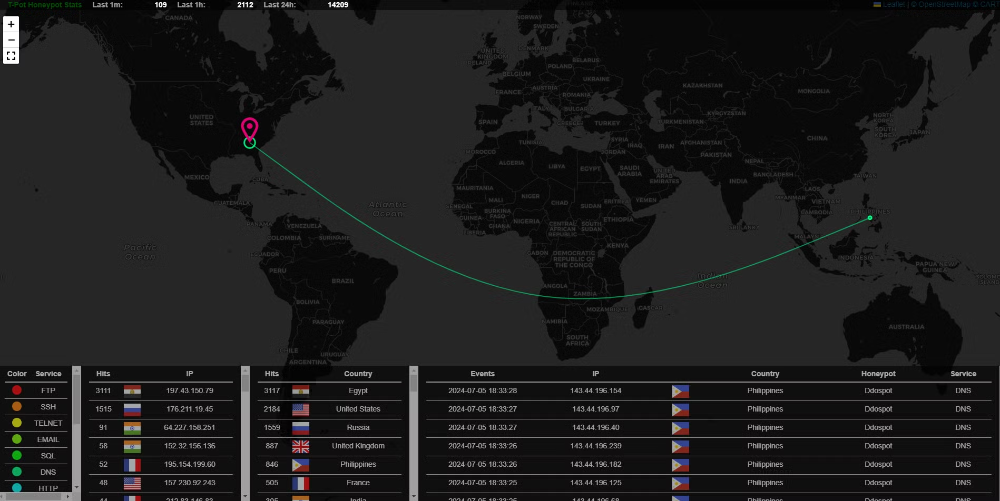
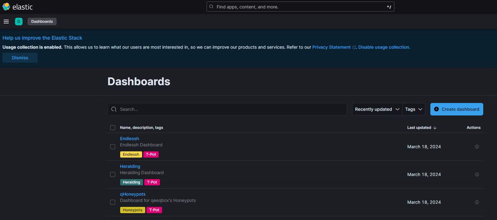
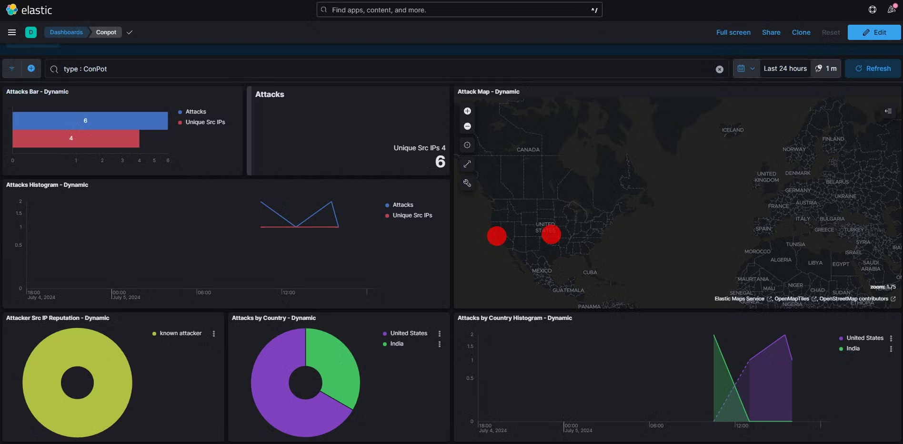
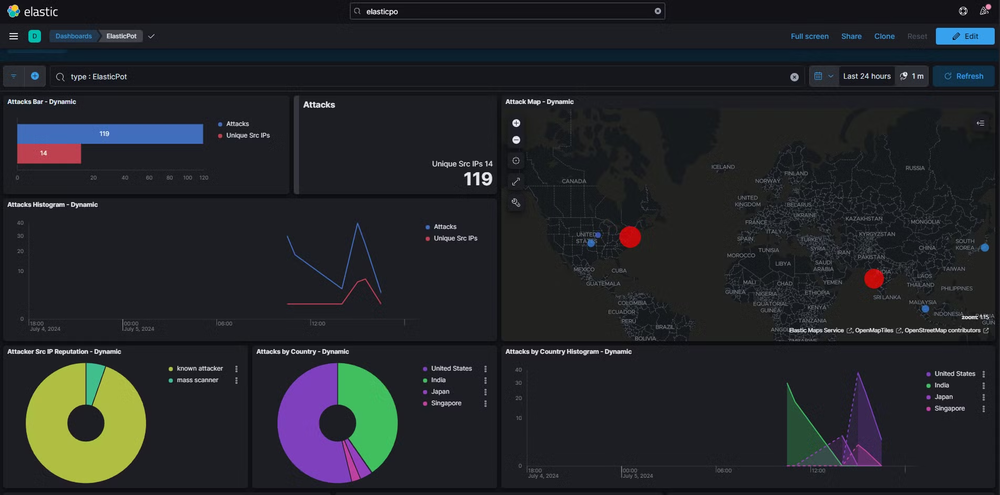
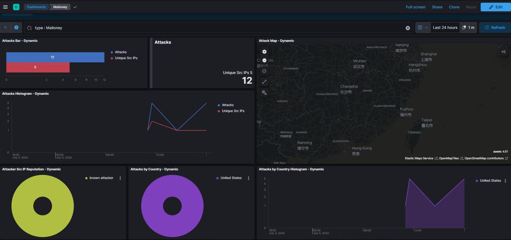
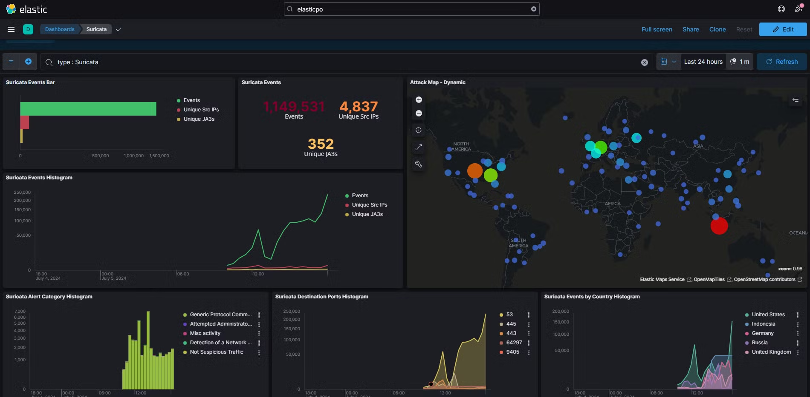
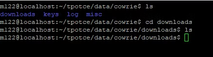

# Setting-Up and Analysis of Cloud-based Honey Pot

## Why a Honey Pot?

1. **Threat Intelligence Gathering**: Honeypots capture detailed information about attack patterns and help identify new threats.
   
2. **Malware Collection and Analysis**: They collect and analyze malware samples, allowing for reverse engineering to understand their behavior and impact.

3. **Understanding Attacker Behavior**: Researchers can observe attacker techniques and credential use, gaining insights into their methods and decision-making.

4. **Improving Defensive Measures**: Data from honeypots enhances intrusion detection systems (IDS/IPS) and aids in developing security policies and countermeasures.

5. **Training and Education**: Honeypots provide real-world scenarios for hands-on learning without risking actual systems.

6. **Forensic Analysis**: They offer valuable forensic data for incident response and can sometimes serve as legal evidence.

7. **Vulnerability Research**: Honeypots help identify system weaknesses and capture zero-day exploits.

8. **Enhancing Threat Sharing**: Honeypot data can be shared with the cybersecurity community, contributing to collaborative defense and threat intelligence feeds.

### Bottom Line:
Honeypots are essential tools that provide researchers with real-world data on cyber threats, enhancing their ability to defend against attacks and share knowledge across the cybersecurity ecosystem.

For this project i decided to use Tpot as the honeypot platform tool which was set up on a cloud server which i will be disscussing in the follwing discussion.

**T-Pot** is a comprehensive honeypot platform that collects a wide range of data to analyze cyber threats:

1. **Network Traffic**: Logs IP addresses, targeted ports, and network protocols (e.g., TCP, UDP).
2. **Attack Signatures**: Captures payloads, malicious code, and specific exploits used against the honeypot.
3. **Intrusion Attempts**: Records brute force attacks, port scans, and other reconnaissance activities.
4. **Malware Samples**: Collects binaries, scripts, and records their execution behavior.
5. **Session Data**: Logs commands and interactive sessions used by attackers on services like SSH or web servers.
6. **Files and Artifacts**: Tracks uploaded and modified files by attackers.
7. **Credential Usage**: Records usernames, passwords, and authentication attempts.
8. **Exfiltration Attempts**: Monitors attempts to exfiltrate data from the honeypot.

## Setting up a Linode linux server

### Step 1: Create a Linode Account

1. Go to the [Linode website](https://www.linode.com/) and sign up for an account. Find a free offer on-line. Below is a link to a current offer from Network Chuck’s YouTube channel.
https://www.youtube.com/redirect?event=video_description&redir_token=QUFFLUhqbThUdHJxVV9NaUozVjd1NTRWNXU1X1FodzlVQXxBQ3Jtc0trc1JheXdCd3ZBeE9sZi1nUVE0Rkc4UUt5b1NKMzZ2Y1ZzbnBiMHd4YWJhM3FUenRZZ21lNVpfS1hobmFtNTUxQTZvYjQyMktqVXc1WlhyUDExWGY3QWM1ZDFtdGE5RV9RR1lRSEVyYWhNc3VCZlF3OA&q=https://ntck.co/linode&v=nTqu6w2wc68

2. Complete the registration process and log in to your Linode account.

### Step 2: Create a New Linode

Linode calls its VMs “Linodes”

1. Once logged in, navigate to the Linode dashboard.
2. Click on the "Create" button and select "Linode" from the dropdown menu.

### Step 3: Configure Your Linode

1. **Choose a Distribution**: Select "Ubuntu" as your operating system. You can choose the latest LTS version available.
2. **Region**: Select the data center region closest to you or your target audience for better latency.
3. **Linode Plan**: Choose a plan that fits your needs. The Shared CPU plans are usually sufficient for most use cases. T-Pot documentation recommends at least 8-16 GB RAM, 128 GB free disk space.
4. **Linode Label**: Enter a label to identify your Linode.
5. **Root Password**: Set a strong root password for your server.

### Step 4: Deploy Your Linode

1. Review your configuration and click the "Create Linode" button.
2. Wait for Linode to provision your server. This may take a few minutes.

### Step 5: Access Your Linode

1. Once your Linode is running, you will see it listed on the dashboard.
2. Click on your Linode to access its details.
3. Note the public IP address assigned to your Linode.

### Step 6: Connect to Your Linode

1. SSH to the server. If you are on a Windows machine I recommend using putty. If you are on a Mac or Linux you can use the terminal.

2. Login as root and use the password you set up when creating the Linode.

3. Once logged in, create a new user. This step is necessary because the T-Pot installation script cannot be run as the root user. Use the command below to create a new user:
```go
adduser <your user name>
```

You will be prompted to create a password.

1. Add the new user to the sudoer group by using the command below:

```go
usermod -aG sudo <you user name>
```

2. Switch to the new user using the command below:

```go
su <your user name>
```

### Installation of T-pot 

1. Once you have changed users, change the directory to the $HOME directory.

```go
cd $HOME
```

2. Run the following command:

```go
env bash -c "$(curl -sL https://github.com/telekom-security/tpotce/raw/master/install.sh)"
```
3. When completed you should receive the message seen below that asks you to reboot the system.
   
  
   Note the port number. 

The next time you ssh to the server use that port number (64295) instead of port 22.

## Connect to T-POT Dashboard

Navigate to your dashboard (https://<your server IP>:64297) 


You are now connected and the honeypot is online and is likely already being attacked.

Select the Attack Map for a pew pew map view.



The Kibana menu will be the most used menu item. It is where the various dashboards are located.


### Specific T-Pot Tool Dashboards and Their Data

T-Pot integrates several honeypot tools, each designed to capture specific types of data:

- **Dionaea**: Captures malware and exploits for various services.
   
- **Cowrie**: An SSH and Telnet honeypot that logs commands and sessions.
   
- **Conpot**: An ICS/SCADA honeypot that emulates industrial control systems.
   

- **Elasticpot**: Mimics Elasticsearch to capture attacks targeting this service.
   
- **Mailoney**: Collects data from email-based attacks.
   
- **Surricata**: Network Traffic
   

## **Dionaea**

Since I am interested in malware, the first honeypot tool we will analyze is from Dionaea. Dionaea is an open-source honeypot designed to trap and analyze malicious activities by emulating a range of vulnerable services. Here’s a detailed overview of Dionaea:

### Features and Capabilities:

**Summary of Features:**

1. **Service Emulation**: Emulates various services like SMB, HTTP/HTTPS, FTP, MySQL, TFTP, MS-SQL, SIP, MQTT, and RDP to attract attacks.
   
2. **Malware Capture**: Captures malware exploiting vulnerabilities in emulated services and saves the binaries for analysis.

3. **Exploitation Detection**: Logs details of exploitation attempts, including attack sources and methods.

4. **Protocol Emulation**: Emulates multiple protocols to attract diverse attacks and capture a wide range of malware.

5. **Logging and Reporting**: Stores attack details (IP, timestamp, exploit type) in formats like SQLite and JSON.

6. **Modularity**: Supports easy addition of new protocols and features via a plugin-based architecture.

## Analysis

Starting with the dashboard we can see that the vast majority of attacks picked up by Dionaea are abusing the SMB protocol. The majority of the attacks originated within Vietnam and were from known attackers.


Correlating the top IP addresses with Virus Total shows confirms that these IP addresses have been associated with malicious activity in the past.  


At the macro level this information is interesting. However, blocking IP addresses is like playing whack-a-mole. David Bianco’s Pyramid of Pain identifies that it is trivial for a malicious actor to overcome blocking IP addresses. The value of Dionaea and other honeypot tools is the ability to collect malware samples. This will allow us to conduct malware analysis and build rules and detections/alerts on the malware behavior. 

To retrieve the malware we need to ssh into the T-Pot server over port 64295. The path to the malware samples is /tpotce/data/dionaea/binaries.

As seen above there was only one unique malware sample collected. To quickly triage the sample we can run the hashes in VirusTotal. As seen below it was identified as being malicious. In fact, it says it is WannaCry, which should not be surprising considering that the majority of the attacks were attempting to abuse SMB. WannaCry uses the leaked NSA exploit EternalBlue to abuse SMB. However the longer you leave the Tpot up and running the more samples of malwares you might be able to recover from the malware samples folder on the server instance running T-pot.


## **Cowrie**
is an open-source honeypot that emulates **SSH** and **Telnet** services to capture and analyze unauthorized access attempts.

### Key Features:
1. **SSH and Telnet Emulation**: Simulates these protocols, logging login attempts and attacker commands.
2. **Session Logging**: Records commands and entire interactive sessions for replay and analysis.
3. **File System Emulation**: Provides a fake file system for attackers to interact with, capturing file uploads/downloads for malware analysis.
4. **Credential Harvesting**: Logs all usernames and passwords used in login attempts, helping to understand attack patterns.

### Bottom Line:
Cowrie offers detailed insights into attacker behavior and access attempts, helping researchers and security professionals improve threat detection and defenses. It also includes a dashboard for tracking attack types and origins.

## Analysis

The Cowrie dashboard provides a macro-level characterization of the SSH and Telnet attacks. This includes the number and type of attacks, as well as where the attacks are coming from.


Additionally, it includes the top user names and passwords attempted during the attacks, as well as the command line inputs used during the attack.


Once again, the dashboard provides a high level view of activity. We can dig deeper by using the Discover and Visualization features of Kibana.

In the Discover feature we can filter for Cowrie logs and the input field, which includes the command line inputs. The results show what commands the attacker ran from the CLI.


By using the Visualization feature we can build a table that shows the unique commands that were ran and the number of times they were ran.

We could create the same type of tables for any fields, including IP addresses.

### Downloaded Malware

Additionally, if any files were downloaded to the honeypot, we can retrieve those by using SSH to the server, similar to the way we previously did with Dionaea. The path to the Cowrie downloads is tpotce/data/cowrie/downloads.

As seen below, no files were downloaded; however, the honeypot has only been online for a few hours. Ideally the honeypot should run for a few days before beginning analysis.


## Heralding

**Heralding** is an open-source honeypot designed primarily for logging credentials across various protocols, making it highly effective for capturing and analyzing login attempts.

### Features and Capabilities

1. **Protocol Emulation**:
   - **SSH**: Captures credentials from SSH login attempts.
   - **Telnet**: Logs credentials used with the Telnet protocol.
   - **FTP**: Logs login attempts for FTP services.
   - **HTTP/HTTPS**: Captures credentials submitted through basic and digest authentication.
   - **SMTP**: Logs email server login attempts.
   - **POP3**: Captures email access credentials.
   - **IMAP**: Logs credentials used for email access.
   - **VNC**: Captures login attempts for VNC services.

2. **Credential Logging**:
   - Logs all usernames and passwords attempted across various protocols.
   - Provides detailed information on the source of login attempts, including IP addresses and timestamps.

### Use Cases

1. **Credential Harvesting**:
   - Ideal for capturing and analyzing login attempts and common credentials used by attackers.
   - Helps identify weak passwords.

2. **Threat Intelligence**:
   - Provides valuable data on login patterns, aiding in the development of threat intelligence.
   - Useful for defending against credential stuffing and brute force attacks.

3. **Network Security Monitoring**:
   - Deployed to detect and log unauthorized access attempts.
   - Acts as an early warning system by capturing login attempts, allowing proactive responses.

Heralding is a lightweight yet powerful tool, ideal for organizations focused on improving security by understanding credential-based attacks and enhancing network defenses.

## Analysis

The dashboard provides the number of attacks and where they originated.


Additionally, it shows the protocol, username and password attempted. 


## Cisco ASA

The **Cisco ASA** (Adaptive Security Appliance) module in **T-Pot** emulates a Cisco ASA firewall, providing a high-interaction honeypot to attract and analyze attacks on this type of network device. T-Pot is a comprehensive honeypot platform that integrates multiple honeypot technologies, and the Cisco ASA module adds the ability to mimic real-world enterprise environments.

### Features and Capabilities

1. **Emulation of Cisco ASA Firewall**:
   - **Command Execution**: Emulates the CLI of a Cisco ASA firewall, allowing attackers to interact as they would with a real device.
   - **Configuration Simulation**: Allows attackers to attempt to view or modify firewall configurations in a realistic environment.

2. **Logging and Analysis**:
   - **Command Logging**: Records all commands entered by attackers to capture their actions and methods.
   - **Session Logging**: Logs entire sessions for replay and detailed analysis.

3. **Credential Capture**:
   - Captures usernames and passwords used in login attempts, offering insights into common credentials and attack patterns.

4. **High-Interaction Environment**:
   - Closely mimics a real Cisco ASA firewall, making it more likely to capture sophisticated attack techniques and behaviors.

5. **Integration with T-Pot**:
   - Fully integrated into the T-Pot platform for centralized logging, analysis, and visualization.
   - Contributes valuable data to the T-Pot threat intelligence ecosystem.

### Use Cases

1. **Research and Analysis**:
   - Enables researchers to study attack techniques targeting Cisco ASA firewalls.
   - Analyzes how attackers exploit firewall vulnerabilities and misconfigurations.

2. **Threat Intelligence**:
   - Provides data for identifying emerging threats and trends in attacks on network security devices.
   
3. **Network Security Monitoring**:
   - Detects and logs unauthorized access attempts on firewalls, acting as a decoy to divert attackers from critical infrastructure.

### Benefits

- **Realistic Emulation**: Offers a realistic simulation of a Cisco ASA firewall, making it attractive to attackers and improving the quality of captured data.
- **Comprehensive Logging**: Provides detailed logs of attacker interactions, aiding in thorough analysis.
- **Enhanced Security Posture**: Helps organizations understand threats and improve defensive measures by analyzing attacks on emulated firewalls.

The **Cisco ASA module** in T-Pot is a powerful tool for security researchers and organizations looking to study and defend against attacks on Cisco ASA firewalls, offering realistic emulation and detailed analysis capabilities.

## Analysis

The dashboard provides the same type of information as previously discussed dashboards, with the major exception that these attacks are targeting Cisco ASA firewalls.


